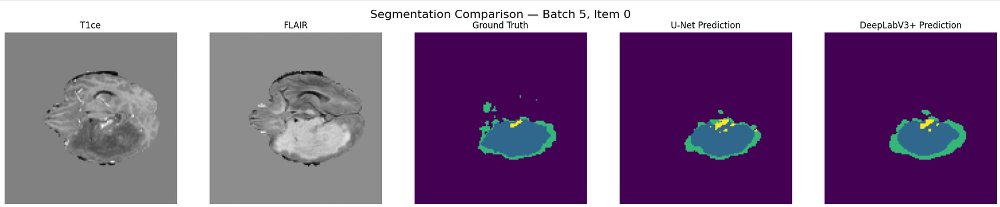

# Brain Tumor Segmentation — U-Net vs DeepLabv3+

This project compares two deep-learning architectures for **brain tumor semantic segmentation** on the **BraTS 2020** MRI dataset:

- **U-Net**
- **DeepLabv3+**

The notebook processes multimodal brain MRI scans and predicts tumor regions using four input modalities: **T1, T1ce, T2, and FLAIR**.

## What the notebook does

The notebook provides the complete segmentation pipeline:

1. Downloads and explores the BraTS 2020 dataset.
2. Splits the annotated patients into **training, validation, and test sets** at patient level.
3. Preprocesses MRI slices with normalization and label remapping.
4. Builds a custom **2D U-Net** and a **2D DeepLabv3+** model.
5. Trains or loads pretrained model weights.
6. Evaluates both models on the same unseen test set.
7. Computes segmentation metrics for the main BraTS tumor regions:
   - **ET** — Enhancing Tumor
   - **TC** — Tumor Core
   - **WT** — Whole Tumor
8. Produces a final numerical comparison and a side-by-side visualization of the segmentations predicted by the two models.

## Model comparison

| Metric | U-Net | DeepLabv3+ | Best |
|---|---:|---:|---|
| ET Dice | **0.7966** | 0.7887 | U-Net |
| ET IoU | **0.6619** | 0.6511 | U-Net |
| TC Dice | 0.8016 | **0.8416** | DeepLabv3+ |
| TC IoU | 0.6689 | **0.7265** | DeepLabv3+ |
| WT Dice | 0.8828 | **0.8909** | DeepLabv3+ |
| WT IoU | 0.7902 | **0.8033** | DeepLabv3+ |
| **Mean Dice** | 0.8270 | **0.8404** | **DeepLabv3+** |
| **Mean IoU** | 0.7070 | **0.7270** | **DeepLabv3+** |
| Pixel Accuracy | 0.9943 | **0.9949** | DeepLabv3+ |

Overall, **DeepLabv3+ performs slightly better than U-Net**, especially for **Tumor Core (TC)** segmentation, while U-Net obtains a slightly better score on the **Enhancing Tumor (ET)** region.

## Dataset

The notebook uses the **BraTS 2020** dataset and downloads it through KaggleHub:

`talhaumar/brats2020-correct-dataset-training-validation`

Because the official BraTS validation set does not provide public ground-truth labels, the annotated training subjects are divided into train, validation, and test subsets.

## Main metrics

The models are evaluated using:

- Dice Score
- Intersection over Union (IoU)
- Mean Dice
- Mean IoU
- Pixel Accuracy

The final evaluation is performed on patients that are not used during training or validation.

## Notebook

Main file: `final_version.ipynb`
The notebook can be run in a GPU-enabled environment such as **Google Colab** or **Kaggle**.